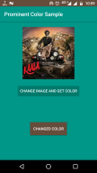
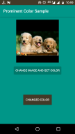
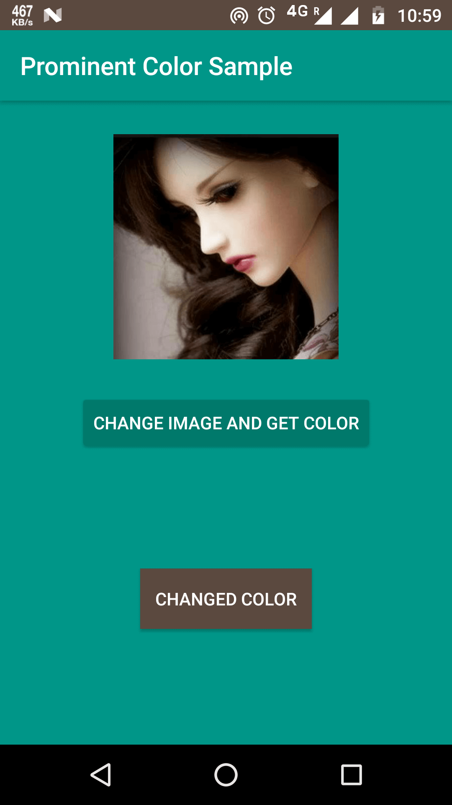
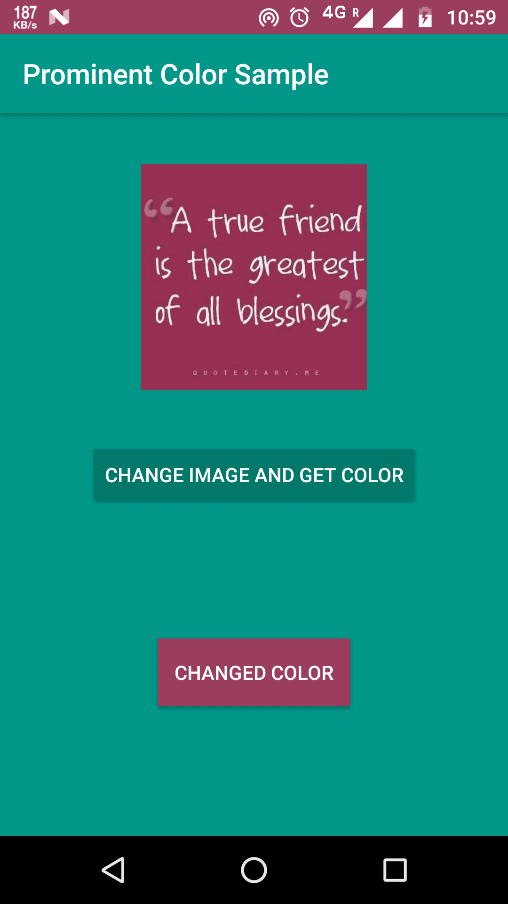

# ProminentColor
Android Library to get average/prominent of bitmap/drawable

### Gradle

#### Step 1. Add the JitPack repository to your build file
  Add it in your root build.gradle at the end of repositories:
    
    allprojects {
		repositories {
			...
			maven { url "https://jitpack.io" }
		  }
	  }
#### Step 2. Add the dependency
    
    dependencies {
	        compile 'com.github.mathiazhagan01:ProminentColor:v1.0'
	  }
	  
### Maven

#### Step 1. Add the JitPack repository to your build file

    <repositories>
		  <repository>
		      <id>jitpack.io</id>
		      <url>https://jitpack.io</url>
		  </repository>
	  </repositories>
	  
#### Step 2. Add the dependency
	
	  <dependency>
	      <groupId>com.github.mathiazhagan01</groupId>
	      <artifactId>ProminentColor</artifactId>
	      <version>V1.0</version>
	  </dependency>

### Example 1
 
  ProminentColor prominentColor = new ProminentColor();
  
              prominentColor.setBitmap(bitmap);
            prominentColor.getColor(new ProminentColorListener() {

                @Override
                public void onGettingColor(int color) {
                    if (Build.VERSION.SDK_INT >= Build.VERSION_CODES.LOLLIPOP) {
                        getWindow().setStatusBarColor(color);
                    }
                    colorButton.setBackgroundColor(color);
                }
            });
   
### LICENSE

	ProminentColor library for Android
	Copyright (c) 2017 Mathiazhagan Dinesh (http://github.com/mathiazhagan01).

	Licensed under the Apache License, Version 2.0 (the "License");
	you may not use this file except in compliance with the License.
	You may obtain a copy of the License at

	http://www.apache.org/licenses/LICENSE-2.0

	Unless required by applicable law or agreed to in writing, software
	distributed under the License is distributed on an "AS IS" BASIS,
	WITHOUT WARRANTIES OR CONDITIONS OF ANY KIND, either express or implied.
	See the License for the specific language governing permissions and
	limitations under the License.
